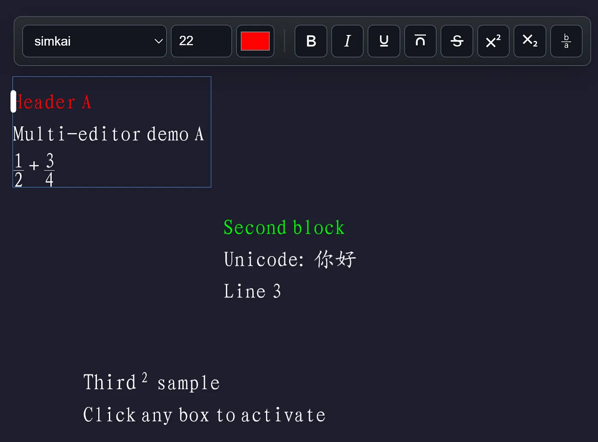
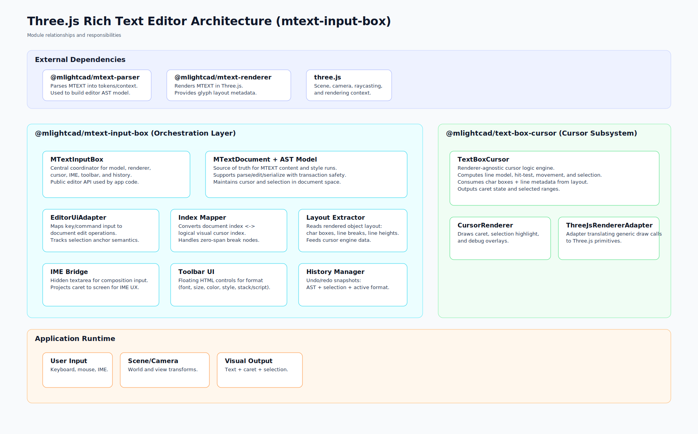

# Three.js Rich Text Editor

Three.js-based MTEXT editor component with built-in IME bridge, cursor/selection rendering, and floating toolbar.



## Purpose

- MTEXT-style editing in Three.js
- Keyboard/mouse/IME editing, selection, formatting, and undo/redo
- Built-in toolbar (configurable theme, font list, container, and offset)
- Integration with `@mlightcad/mtext-renderer` and `@mlightcad/text-box-cursor`

## Technical Details

- Medium article: [Building a Three.js Rich Text Editor](https://medium.com/@mlightcad/building-a-three-js-rich-text-editor-b7283126ee97)



## Install

```bash
pnpm add @mlightcad/mtext-input-box three @mlightcad/mtext-parser @mlightcad/mtext-renderer
```

`@mlightcad/mtext-parser` and `@mlightcad/mtext-renderer` are peer dependencies of `@mlightcad/mtext-input-box`, so your app should install them directly.

## Basic Usage

```ts
import * as THREE from 'three';
import { MTextInputBox } from '@mlightcad/mtext-input-box';

const scene = new THREE.Scene();
const camera = new THREE.OrthographicCamera(0, 1000, 600, 0, -1000, 1000);
const canvas = document.querySelector<HTMLCanvasElement>('#stage')!;

const editor = new MTextInputBox({
  scene,
  camera,
  width: 800,
  position: new THREE.Vector3(80, 520, 0),
  initialText: 'Hello\\PWorld',
  imeTarget: canvas,
  defaultFormat: {
    fontFamily: 'monospace',
    fontSize: 24,
    bold: false,
    italic: false,
    underline: false,
    overline: false,
    strike: false,
    aci: null,
    rgb: 0xffffff
  },
  toolbar: {
    enabled: true,
    theme: 'dark',
    offsetY: 12
  }
});

function animate() {
  requestAnimationFrame(animate);
  editor.update();
}
animate();
```

Notes:

- `imeTarget` is required for text input/IME and built-in mouse interactions.
- For multi-editor scenes, each editor instance can share the same canvas `imeTarget`.

## Toolbar

The built-in toolbar is a DOM overlay mounted above the active editor and updated automatically when the camera or viewport changes.

`toolbar` options:

- `enabled?: boolean` (default `true`)
- `theme?: 'light' | 'dark'` (default `dark`)
- `fontFamilies?: string[]` (default `['Arial', 'Helvetica', 'Verdana', 'Tahoma', 'Trebuchet MS', 'Times New Roman', 'Georgia', 'Courier New', 'system-ui', 'sans-serif', 'serif', 'monospace']`)
- `colorPicker?: (context) => { setValue?, setTheme?, dispose? }` (optional custom picker factory)
- `container?: HTMLElement` (default `document.body`)
- `offsetY?: number` (default `10`)

Custom color picker factory context:

- `container: HTMLElement`: mount point for your UI.
- `theme: 'light' | 'dark'`: current toolbar theme.
- `initialColor: '#RRGGBB'`: initial color.
- `onChange(hexColor)`: call this when user picks a new color.

Custom color picker instance methods:

- `setValue(color: MTextColor)`: sync when editor format changes (color may be ACI or RGB).
- `setTheme(theme)`: optional hook for theme changes.
- `dispose()`: cleanup any mounted resources.

Example (mount a Vue color picker):

```ts
import { createApp, h, ref } from 'vue';
import { getColorByIndex } from '@mlightcad/mtext-renderer';
import { MTextColor } from '@mlightcad/mtext-parser';

toolbar: {
  colorPicker: ({ container, initialColor, theme, onChange }) => {
    const color = ref(initialColor);
    const toHex = (value: MTextColor) => {
      if (value.isRgb && value.rgbValue !== null) {
        return `#${value.rgbValue.toString(16).padStart(6, '0')}`;
      }
      if (value.isAci && value.aci !== null) {
        return `#${getColorByIndex(value.aci).toString(16).padStart(6, '0')}`;
      }
      return '#ffffff';
    };
    const app = createApp({
      render() {
        return h(MyVueColorPicker, {
          modelValue: color.value,
          theme,
          'onUpdate:modelValue': (next: string) => {
            color.value = next;
            onChange(next);
          }
        });
      }
    });

    app.mount(container);

    return {
      setValue(next: MTextColor) {
        color.value = toHex(next);
      },
      setTheme(nextTheme: 'light' | 'dark') {
        // Optional: forward theme into your picker state if needed.
      },
      dispose() {
        app.unmount();
      }
    };
  }
}
```

Public toolbar-related methods:

- `setToolbarTheme('light' | 'dark')`
- `getToolbarTheme()`

## Editor Visibility And Activation

- Click inside editor bounds: activate editor and start editing.
- Click outside active editor bounds: editor closes (`closeEditor()` behavior).
- Double-click rendered text of a closed editor: re-open (`showEditor()` behavior).
- Programmatic control:
  - `closeEditor(): void`
  - `showEditor(): boolean`

## Important Options

- `defaultFormat`: base insert format and renderer fallback style source.
- `imeTarget`: element used by built-in IME bridge and built-in pointer interactions.
- `enableWordWrap?: boolean`: enable/disable editor-side wrapping behavior.
- `showBoundingBox?: boolean`: show editor boundary rectangle.
- `boundingBoxStyle?: { color?, opacity?, padding?, zOffset? }`: boundary style overrides.
- `workerUrl?: string | URL`: worker URL for renderer initialization.
- `cursorStyle` / `selectionStyle`: forwarded to cursor renderer.
- `toolbar`: built-in toolbar options (`enabled`, `theme`, `fontFamilies`, `colorPicker`, `container`, `offsetY`).

## Input And Interaction

Built-in handling:

- Keyboard editing (including macOS/Windows shortcut variants)
- IME composition (via hidden textarea bridge)
- Mouse selection and word-select:
  - `mousedown`: place cursor / shift-select
  - `mousemove` during drag: update selection
  - `mouseup`: stop drag
  - `dblclick`: select word

Advanced control:

- `attachIme(target)` / `detachIme()`
- `attachPointerInteractions(target)` / `detachPointerInteractions()`

## Events

- `change`
- `selectionChange`
- `cursorMove`
- `show`
- `close`

## Undo / Redo

- API:
  - `undo(): boolean`
  - `redo(): boolean`
- Keyboard:
  - `Ctrl/Cmd + Z`: undo
  - `Ctrl/Cmd + Y`: redo
  - `Ctrl/Cmd + Shift + Z`: redo

## Lifecycle

- Call `editor.update()` inside your render loop.
- Call `editor.dispose()` when unmounting to release renderer, cursor, IME, toolbar, and pointer listeners.

## Development

```bash
pnpm --filter @mlightcad/mtext-input-box lint
pnpm --filter @mlightcad/mtext-input-box build
```
